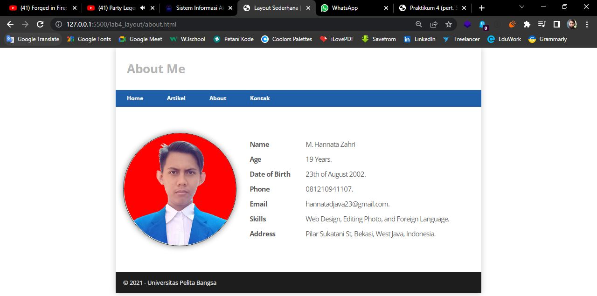
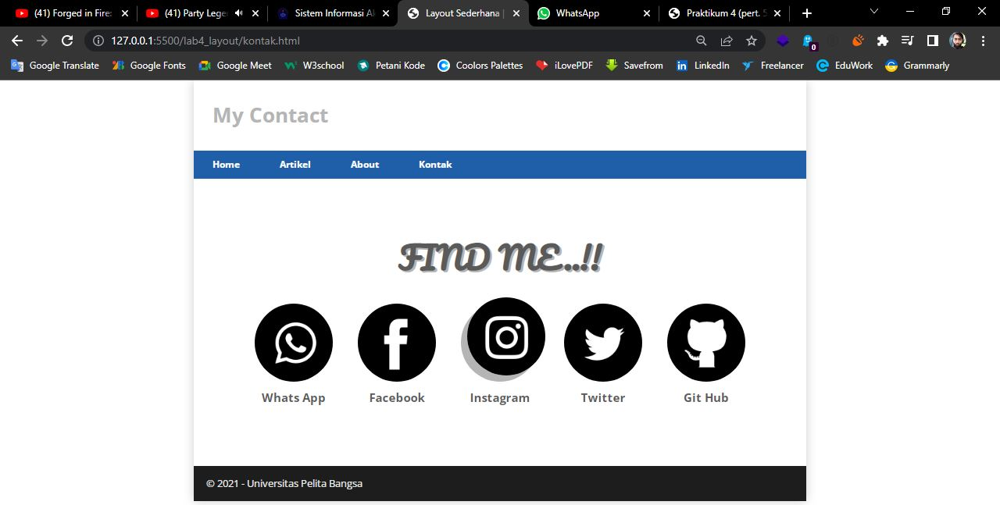

## 1. Membuat box element dan CSS float property

```html
<!DOCTYPE html>
<html lang="en">
<head>
    <meta charset="UTF-8">
    <meta http-equiv="X-UA-Compatible" content="IE=edge">
    <meta name="viewport" content="width=device-width, initial-scale=1.0">
    <title>Box Element</title>

    <!-- ini CSS Property -->

    <style>        
        div{
            float: left;
            padding: 10px;
            color: lightcoral;
            border: 1px solid gray;
        }
        .box1{
            background-color: green;
        }
        .box2{
            background-color: lightsteelblue;
        }
        .box3{
            background-color: black;
        }

    </style>
</head>
<body>
    <header>
        <h1>Box Element</h1>
    </header>

    <!-- ini Box Element -->

    <section>
        <div class="box1">Box 1</div>
        <div class="box2">Box 2</div>
        <div class="box3">Box 3</div>
    </section>

</body>
</html>
```
### Hasilnya...


## 2. Mengatur clearfix element
```html
<!-- menambahkan elemen "div" -->

<section>
    <div class="box1">Box 1</div>
    <div class="box2">Box 2</div>
    <div class="box3">Box 3</div>
    <div class="box4">Box 4</div>
</section>

```
```css
<style>

/* menambahkan property clear pada CSS */

div{
    float: left;
    padding: 10px;
    color: lightcoral;
    border: 1px solid gray;
}
.box1{
    background-color: green;
}
.box2{
    background-color: lightsteelblue;
}
.box3{
    background-color: black;
}
.box4{
    background-color: red;
    clear: left;
    float: none;
}
</style>
```
### Hasilnya...


## 3. membuat layout sederhana
```html
<body>
    <div id="container">
        <header>
            <h1>Web Sederhana</h1>
        </header>
        <nav>
            <a href="home.html">Home</a>
            <a href="artikel.html">Artikel</a>
            <a href="about.html">About</a>
            <a href="kontak.html">Kontak</a>
        </nav>
        <section id="hero"></section>
        <section id="wrapper">
            <section id="main"></section>
            <section id="sidebar"></section>
        </section>
        <footer>
            <p>&copy; 2021 - Universitas Pelita Bangsa</p>
        </footer>
    </div>
</body>
```

### Hasilnya...


```css
@import url('https://fonts.googleapis.com/css2?family=Open+Sans:ital,wght@0,300;0,400;0,600;0,700;0,800;1,300;1,400;1,600;1,700;1,800&display=swap');
@import url('https://fonts.googleapis.com/css2?family=Open+Sans+Condensed:ital,wght@0,300;0,700;1,300&display=swap');

/* reset CSS */

*{
    margin: 0px;
    padding: 0px;
}
body{
    line-height: 1;
    font-size: 100%;
    font-family: 'Open Sans', sans-serif;
    color: #5a5a5a;
}
#container{
    width: 980px;
    margin: 0px auto;
    box-shadow: 0px 0px 1em #ccc;
}

/* header */

header{
    padding: 20px;
}
header h1{
    margin: 20px 10px;
    color: #b5b5b5;
}
```

### Hasilnya...


## 4. Membuat navigasi
```css
/* navigasi */

nav{
    display: block;
    background-color: #1f5faa;
}
nav a{
    padding: 15px 30px;
    display: inline-block;
    color: #fff;
    font-size: 15px;
    text-decoration: none;
    font-weight: bold;
}
nav a:active, nav a:hover{
    background-color: #2b85ea;
}
```

### Hasilnya...


## 5. Membuat hero panel

HTML-nya
```html
<section id="hero">
    <h1>Hello World</h1>
    <p>
        Lorem ipsum dolor sit, amet consectetur adipisicing elit. Nam delectus fugiat, voluptates doloribus aperiam magnam laboriosam dolor? Perferendis, vitae! Architecto dolores ratione eum veniam labore eligendi hic atque consectetur minus reprehenderit dignissimos dolor, eos illo voluptatum autem maiores dolorum quibusdam id dicta sint minima provident! Beatae quam voluptatibus dolores animi.
    </p>
    <a href="home.html" class="btn btn-large"></a>
</section>
```

CSS-nya
```css
/* Hero panel */

#hero{
    background-color: #e4e4e5;
    padding: 50px 20px;
    margin-bottom: 20px;
}
#hero h1{
    margin-bottom: 20px;
    font-size: 35px;
}
#hero p{
    margin-bottom: 20px;
    font-size: 18px;
    line-height: 25px;
}
```

### Hasilnya...


## 6. Mengatur layout main dan sidebar
```css
/* main content */

#wrapper{
    margin: 0px;
}
#main{
    float: left;
    width: 640px;
    padding: 20px;
}

/* sidebar area */

#sidebar{
    float: left;
    width: 260px;
    padding: 20px;
}
```

## 7. Membuat sidebar widget
HTML-nya
```html
<aside id="sidebar">
    <div class="widget-box">
        <h3 class="title">Widget Header</h3>
        <ul>
            <li><a href="#">Widget Link/a></li>
            <li><a href="#">Widget Link/a></li>
            <li><a href="#">Widget Link/a></li>
            <li><a href="#">Widget Link/a></li>
            <li><a href="#">Widget Link/a></li>
        </ul>
    </div>
    <div class="widget-bo">
        <h3 class="title">Widget Text</h3>
        <p>
            Lorem ipsum dolor sit, amet consectetur adipisicing elit. Obcaecati animi tenetur dolores cumque voluptates at esse natus minima cupiditate facere fuga ex reprehenderit quos, dolorum repellat saepe. Deserunt, quibusdam rerum?
        </p>
    </div>
</aside>
```

CSS-nya
```css
/* Widget Box */

.widget-box{
    border: 1px solid #eee;
    margin-bottom: 20px;
}
.widget-box .title{
    padding: 10px 16px;
    background-color: #428bca;
    color: #fff;
}
.widget-box ul{
    list-style-type: none;
}
.widget-box li{
    border-bottom: 1px solid #eee;
}
.widget-box li a{
    padding: 10px 16px;
    color: #333;
    display: block;
    text-decoration: none;
}
.widget-box li:hover a{
    background-color: #eee;
}
.widget-box p{
    padding: 15px;
    line-height: 25px;
}
```

### Hasilnya...


## 8. Mengatur footer
```css
footer{
    clear: both;
    background-color: #1d1d1d;
    padding: 20px;
    color: #eee;
}
```

### Hasilnya...


## 9. Menambahkan elemen lainnya pada main content
HTML-nya
```html
<section id="main">
    <div class="row">
        <div class="box">
            
            <h3>Heading</h3>
            <p>Lorem ipsum dolor sit amet, consectetur adipisicing elit. Unde, reiciendis.</p>
            <a href="#" class="btn btn-default">View Detail</a>
        </div>
        <div class="box">
            
            <h3>Heading</h3>
            <p>Lorem ipsum dolor sit amet, consectetur adipisicing elit. Tempora, dicta.</p>
            <a href="#" class="btn btn-default">View Detail</a>
        </div>
        <div class="box">
            
            <h3>Heading</h3>
            <p>Lorem ipsum dolor sit amet consectetur, adipisicing elit. Aliquam, animi.</p>
            <a href="#" class="btn btn-default">View Detail</a>
        </div>
    </div>
</section>
```

CSS-nya
```css
/* Box */

.box{
    display: block;
    float: left;
    width: 33.333333%;
    box-sizing: border-box;
    -moz-box-sizing: border-box;
    -webkit-box-sizing: border-box;
    padding: 0px 10px;
    text-align: center;
}
.box h3{
    margin: 15px 0px;
}
.box p{
    line-height: 20px;
    font-size: 14px;
    margin-bottom: 15px;
}
box img{
    border: 0px;
    vertical-align: middle;
}
.img-circle{
    border-radius: 50%;
}
.row{
    margin: 0 -10px;
    box-sizing: border-box;
    -moz-box-sizing: border-box;
    -webkit-box-sizing: border-box;
}
.row:after, .row:before, .entry:after, .entry:before{
    content:'';
    display: table;
}
.row:after,.entry:after{
    clear: both;
}
```

### Hasilnya...


## 10. Menambahkan content artikel
HTML-nya
```html
<hr class="divider" />
<article class="entry">
    <h2>First featurette heading.</h2>
    
    <p>Lorem ipsum dolor sit amet, consectetur adipiscing elit. Vestibulum lorem elit, iaculis in nisl volutpat, malesuada tincidunt arcu. Proin in leo fringilla, vestibulum mi porta, faucibus felis. Integer pharetra est nunc, nec pretium nunc pretium ac.</p>
</article>
<hr class="divider" />
<article class="entry">
    <h2>First featurette heading.</h2>
    
    <p>Lorem ipsum dolor sit amet, consectetur adipiscing elit. Vestibulum lorem elit, iaculis in nisl volutpat, malesuada tincidunt arcu. Proin in leo fringilla, vestibulum mi porta, faucibus felis. Integer pharetra est nunc, nec pretium nunc pretium ac.</p>
</article>
```

CSS-nya
```css
.divider{
    border: 0px;
    border-top: 1px solid #eee;
    margin: 40px 0px;
}
.entry{
    margin: 15px 0px;
}
.entry h2{
    margin-bottom: 20px;
}
.entry p{
    line-height: 25px;
}
.entry img{
    float: left;
    border-radius: 5px;
    margin-right: 15px;
}
.entry .rigth-img{
    float: right;
}
```

### Hasilnya...


# Pertanyaan dan Tugas

## 1. Tambahkan layout untuk menu About
HTML-nya
```html
<section class="cont-about">
    <div class="bio">
        
        <div class="list desc1">
            <h3>Name</h3>
            <h3>Age</h3>
            <h3>Date of Birth</h3>
            <h3>Phone</h3>
            <h3>Email</h3>
            <h3>Skills</h3>
            <h3>Address</h3>
        </div>
        <div class="list desc2">
            <h3>M. Hannata Zahri</h3>
            <h3>19 Years.</h3>
            <h3>23th of August 2002.</h3>
            <h3>081210941107.</h3>
            <h3>hannatadjava23@gmail.com.</h3>
            <h3>Web Design, Editing Photo, and Foreign Language </h3>
            <h3>Pilar Sukatani St, Bekasi, West Java, Indonesia.</h3>
        </div>
    </div>
</section>
```

CSS-nya
```css
.cont-about{
    padding: 50px 0px;
}
.bio{
    display: flex;
    flex-direction: row;
}
.bio img{
    margin: 20px;
    border: 2px solid #1d1d1d;
    border-radius: 50%;
    box-shadow: 0px 0px 1em gray;
}
.list{
    position: relative;
    top: 30px;
    left: 15px;
}
.list h3{
    line-height: 40px;
    letter-spacing: -1px;
}
.desc1{
    width: 150px;
}
.desc2 h3{
    font-weight: normal;
}
```

### Hasilnya...


## 2. Tambahkan layout untuk menu Kontak
HTML-nya
```html
<section class="cont-kontak">
    <h2>FIND ME..!!</h2>
    <div class="hajimari">
        <div class="kaado wa">
            <div class="icon icon-wa">
                <a href="#">
                    
                </a>
            </div>
            <h3>Whats App</h3>
        </div>
        <div class="kaado fb">
            <div class="icon icon-fb">
                <a href="#">
                    
                </a>
            </div>
            <h3>Facebook</h3>
        </div>
        <div class="kaado ig">
            <div class="icon icon-ig">
                <a href="#">
                    
                </a>
            </div>
            <h3>Instagram</h3>
        </div>
        <div class="kaado tw">
            <div class="icon icon-tw">
                <a href="#">
                    
                </a>
            </div>
            <h3>Twitter</h3>
        </div>
        <div class="kaado gh">
            <div class="icon icon-gh">
                <a href="#">
                    
                </a>
            </div>
            <h3>Git Hub</h3>
        </div>
    </div>
</section>
```

CSS-nya
```css
.cont-kontak{
    margin: 100px 0px;
}
.cont-kontak h2{
    margin-bottom: 50px;
    font-family: 'Pacifico', cursive;
    font-size: 50px;
    text-align: center;
    text-shadow: 3px 3px #b5b5b5;
}
.hajimari{
    display: flex;
    justify-content: center;
    align-items: center;
}
.kaado h3{
    text-align: center;
    margin-top: 15px;
}
.icon a img{
    width: 125px;
    height: 125px;
    border-radius: 50%;
    margin: 0px 20px;
    /* border: 5px solid green; */
}
.icon a img:hover{
    position: relative;
    bottom: 10px;
    left: 10px;
    box-shadow: -10px 10px #b5b5b5;
}
```

### Hasilnya...
